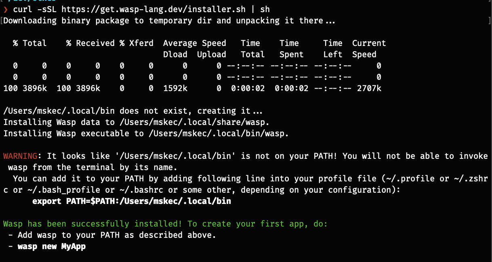
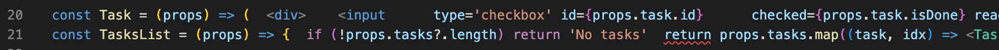

# Wasp Alpha testing

Start: 10:15
End create/update task: 11:20
Start auth: 09:25
End everything: 10:00

## Setup
- Not sure if `.local/bin` is some new way where to install execs



- Creating new project
	- I wanted to name it `wasp-todo` because I like to have dirs with `-`, but this name is invalid
	  `wasp new wasp-todo`
	- It was fast to create a new project

- No Jetbrains plugin for syntax, switched to VS Code

- First start
	- Installing packages, so it took longer than expected.

- `wasp start` is opening a new tab regardless if one is already open or not
- Changing `MainPage.js` to `MainPage.tsx` didn't work. Typescript support would be great
- `ext` feels like a strange dir name for source files
- Is there support for other dbs except `Prisma`?
 - Prettier support would be great

## Tutorial
- Mixing of frontend and backend source files can be confusing.
	- `queries.js` is executed on the backend
	- `MainPage.js` calls `getTasks`, but not from `queries.js` where we defined it, but from `@wasp/queries/getTasks`
	- autocomplete is confused and wants to import from queries `import getTasks` results in `import { getTasks } from './queries'`
- There are some errors/warnings in console after running the code samples in the tutorial
> Warning: Invalid DOM property `readonly`. Did you mean `readOnly`?
> Cross-Origin Request Blocked: The Same Origin Policy disallows reading the remote resource at [http://localhost:3001/operations/get-tasks](http://localhost:3001/operations/get-tasks "http://localhost:3001/operations/get-tasks"). (Reason: CORS request did not succeed). Status code: (null).
- Selecting code and ctrl-c from your tutorial is broken. There are no new lines. [LINK](https://wasp-lang.dev/docs/tutorials/todo-app/listing-tasks)
  If you use `if (...) { }` and semis, it could be autoformatted.
 
- I failed to create a task. I would click submit, I see "Fetching..." flickering, but new task is not created. I see the `description` passed in the network request. 
	- The problem was there because I didn't return in `createTask` action, I only called create. It was confusing because there was no error or warning that something is wrong.

### Authentication
- Password requirements are unexpected, can I modify them?
- Seems simple to add authentication to a web app
- Not sure about the choice of `secure-password` package with 7k weekly downloads for hashing, I would feel better with bcrypt
- Writing file extensions feels different than usual development where it's not required
```
Server (stderr): Error [ERR_MODULE_NOT_FOUND]: Cannot find module '/Users/mskec/dev/other/wasp-todo/.wasp/out/server/src/core/HttpError' imported from /Users/mskec/dev/other/wasp-todo/.wasp/out/server/src/ext-src/queries.js
```

### Dependencies
- Do you support other `package.json` config options like `resolutions`?
